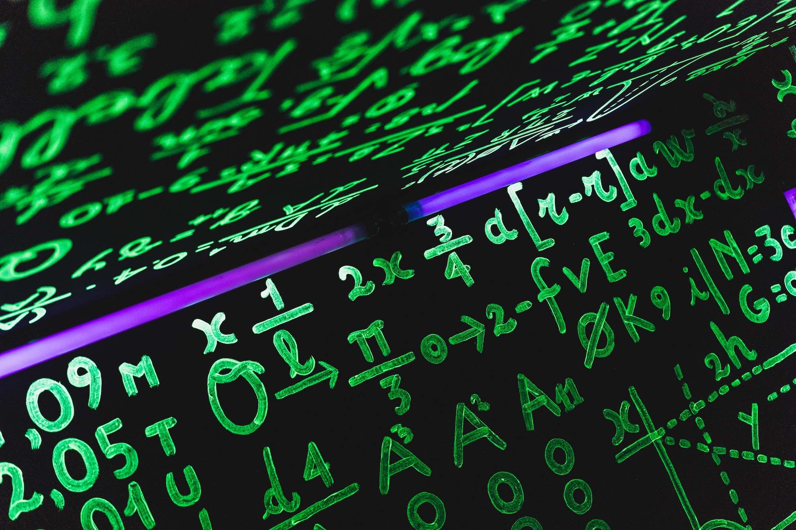
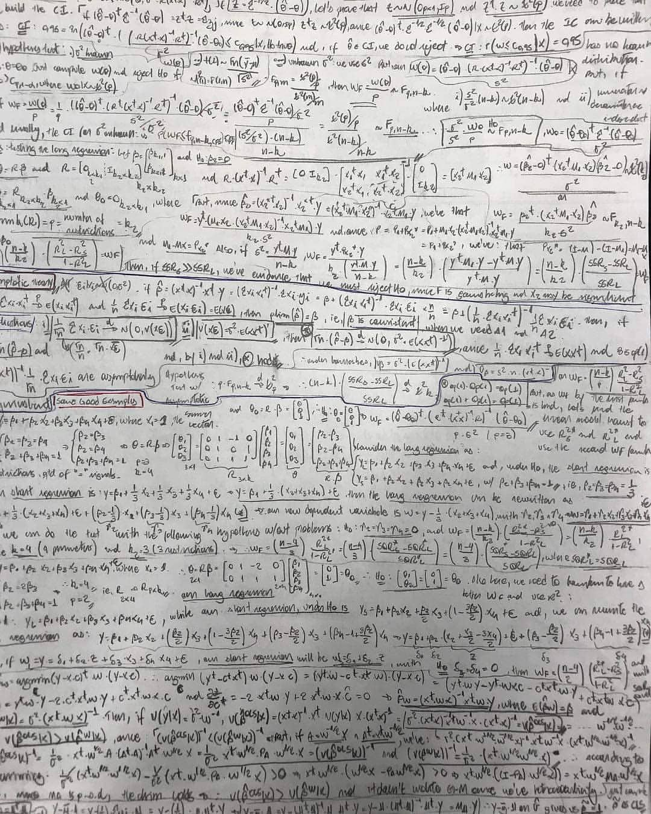

Na publicação de hoje, quero iniciar uma discussão sobre o uso da matemática e estatística na economia, e com essa frase chocante:

> "Mathematical economics is a redundant expression."

Quando uma pessoa estuda economia pela primeira vez, é provável que não encontrará equações "malucas" que vão além da matemática básica. Existe muito conteúdo para aprender as diversas definições conceituais como preço, oferta, demanda, custos, lucro etc, além das várias estruturas de mercado.

À medida que se aprofunda no assunto, percebe que há mais do que apenas teorias simplistas e conversas fiada de jornal. Então, qual seria a melhor maneira de explicar os conceitos de preço, quantidade de produto vendido e custo de produção sem se referir a um único exemplo sem utilizar a matemática?

Este *paper*:

> *KATZNER, Donald W. [Why mathematics in economics?](https://www.jstor.org/stable/4538849?seq=1). Journal of Post Keynesian Economics, v. 25, n. 4, p. 561-574, 2003.*

faz uma defesa bastante convincente do uso da matemática na ciência econômica.

Embora a economia seja tecnicamente reconhecida como uma ciência social, os estudantes que embarcam em uma "nebulosa" aventura (curso de graduação) nesse campo recebem (ou deveriam receber) uma base sólida em matemática. Pois determinar como os recursos escassos podem ser realocados requer um entendimento mínimo em matemática, para calcular qual será o custo de distribuição e avaliar (quantitativamente) entre outras medidas. Assim, o campo da economia está repleto de equações e aplicações matemáticas.

O que se aprende no ensino de economia são principalmente álgebra linear, cálculo e estatística. Essas são a base alcançar a famigerada econometria. Em álgebra é ensinado sobre custo total e receita total. Em cálculo o objetivo é encontrar as derivadas de curvas de indiferença e utilidade, curvas de maximização de lucro, minimização de custo e modelos de crescimento.

Em estatística, os economistas aprendem sobre modelos preditivos e como determinar qual a probabilidade de um certo evento ocorrer. A econometria por alguns motivos peculiares é chamada de *"economentira"* pelo uso de modelos em que o objetivo final é estimar e prever determinada variável.



À medida que se avança nos tópicos relacionados, encontra-se exemplos como as curvas de demanda de mercado (somatória das varias curvas de demanda individual) ou mudanças na oferta e preço de uma *commoditie* ou calcular a elasticidade de preço de um bem de consumo, cada conceito é validado utilizando matemática. Definitivamente, precisa-se de abordagem matemática e estatística para se ter clareza quando chegamos na tão sonhada "solução" para os problemas propostos para os profissionais dessa área.

Foi notado que no século XIX a matemática era considerada como um meio de alcançar a verdade; lógica (racional) tornaram imperativo o uso da matemática para provar quaisquer teoremas. Muitos problemas colocados em economia, portanto, motivados a serem resolvidos pela matemática. Será que realmente foram solucionados esses problema?

Análises e estudos elaborados no campo da economia aplicada ajudam a explicar a relação interdependente entre diferentes variáveis. Um exemplo é tentar explicar o que causa o aumento de preços de um produto, como o preço da carne bovina, ou o aumento da taxa de desemprego, ou até uma queda na inflação e redução da taxa básica de juros. Funções matemáticas são utilizadas como um ferramental lógico através de **modelos** dos quais esses fenômenos da vida cotidiana possam se tornar mais compreensíveis.

De fato, existe uma exaustiva discussão sobre a importância dos trabalhos aplicados que são relevantes e os usos destas métricas na ciência econômica. É interessante saber que vários economistas foram agraciados com o [Prêmio Nobel](https://pt.wikipedia.org/wiki/Pr%C3%A9mio_de_Ci%C3%AAncias_Econ%C3%B3micas_em_Mem%C3%B3ria_de_Alfred_Nobel) por aplicarem matemática/estatística à economia, incluindo o primeiro concedido em 1969 a [Ragnar Frisch e JanTinbergen](https://www.jstor.org/stable/1402316?seq=1). O mais interessante é que [Leonid Kantorovich](https://pt.wikipedia.org/wiki/Leonid_Kantorovich) ganhou um prêmio Nobel em 1975 em economia pela contribuição à teoria da utilização ótima de recursos e ele era um matemático!

Muitos estudantes que estão procurando seguir uma carreira em economia são aconselhados a fazer um curso de Matemática, já que os estudos aplicados estão cobertos de matemática. Pois a utilização de modelos e aplicações matemáticas nesta área tem sido notável nas ultimas duas décadas.

[Economia --- a ciência que deixou de ser sombria](https://valor.globo.com/eu-e/noticia/2012/10/23/como-a-teoria-economica-deixou-de-ser-uma-ciencia-sombria.ghtml), com os avanços de [Alfred Marshall](https://pt.wikipedia.org/wiki/Alfred_Marshall), com a conhecida revolta marginalista que aderiu o uso da matemática como parte integrante da economia, agora mais intensiva do que nunca. A matemática desempenha o papel principal em muitas ciências como a física, química, etc. E é realmente a espinha dorsal da economia moderna.

A matemática na economia é um importante ferramental na tomada de decisões. Economistas são contratados por empresas ou governos para investigar e estimar o risco ou prováveis resultados de um evento. Economistas que trabalham para empresas do mercado financeiro fazem cálculos matemáticos (modelos) para avaliar se o risco de se investir em um determinado ativo supera seus benefícios potenciais.

Os economistas usam suas "habilidades" matemáticas para encontrar maneiras de realocar dinheiro, mesmo de formas contra-intuitivas. Usando um gráfico de maximização de lucro, os economistas podem aconselhar um local a vender apenas 75% dos ingressos disponíveis, em vez de 100%, estratégia para maximizar seu lucro. Se a empresa baixar o preço dos ingressos para atrair novos frequentadores de concertos e encher o estádio de lotação, poderia ganhar menos dinheiro do que vender apenas 75% dos ingressos a um preço muito mais alto.

Os economistas também usam a matemática para determinar o sucesso de longo prazo de um negócio, mesmo quando alguns fatores são imprevisíveis. Por exemplo, um economista que trabalha para uma companhia aérea usa a previsão baseada em modelos econométricos para determinar o preço do combustível para dois meses a frente. A empresa usa esses dados para bloquear os preços dos combustíveis ou para proteger o combustível, o famoso *"hedge"*. Bijan Vasigh, autor do livro ["Introdução à Economia do Transporte Aéreo"](https://www.amazon.com/Introduction-Air-Transport-Economics-Applications/dp/1409454878), explica que a [Southwest Airlines](https://www.southwest.com) ganhou uma vantagem financeira sobre outras operadoras devido à sua estratégia de hedge de combustível.

Porém, nem tudo são flores, muito menos mar de rosas, há limitações do que se pode fazer utilizando modelos econométricos na economia. Economistas realizam cálculos matemáticos com informações imperfeitas. Seus modelos econômicos são inúteis em tempos de desastres naturais, greves sindicais ou qualquer outro evento catastrófico. Além disso, a matemática raramente ajuda os economistas a predizer o comportamento humano irracional. Uma suposição fundamental da economia é que os humanos agem racionalmente. No entanto, os humanos geralmente tomam decisões irracionais baseadas escolhas e prefêrencias, ou até mesmo no puro medo ou no amor. Esses dois fatores não podem ser contabilizados em um modelo econômico.

Mas já existem algumas técnicas, inclusive no campo do *Machine Learning* que tentam solucionar tais problemas. Mas isso é assunto para uma outra publicação que farei em breve.

Mas o potencial desses métodos é reconhecido e por isso é de extrema utilidade, e os economistas estão revisando a maneira como os cálculos são realizados para explicar os efeitos intangíveis, como a poluição. Os modelos matemáticos são necessariamente baseados em hipóteses simplificadoras, portanto, não são propensos a serem perfeitamente realistas. Os modelos matemáticos também carecem das nuances que podem ser encontradas nos modelos narrativos. O ponto é que a matemática é uma ferramenta, mas não é a única ferramenta ou até mesmo a melhor ferramenta que os economistas devem usar.

Então, qual sua opinião quanto ao uso da matemática e estatística na ciência econômica? É possível pensar economia sem ao menos matematiza-la?

Adptado do [original](https://medium.com/the-empirical-mode/o-uso-da-matem%C3%A1tica-na-economia-6d6de2e39dab).

::: callout-note
# Ei! 👋, você achou meu trabalho útil? Considere me comprar um café ☕, clicando aqui 👇🏻

:::
