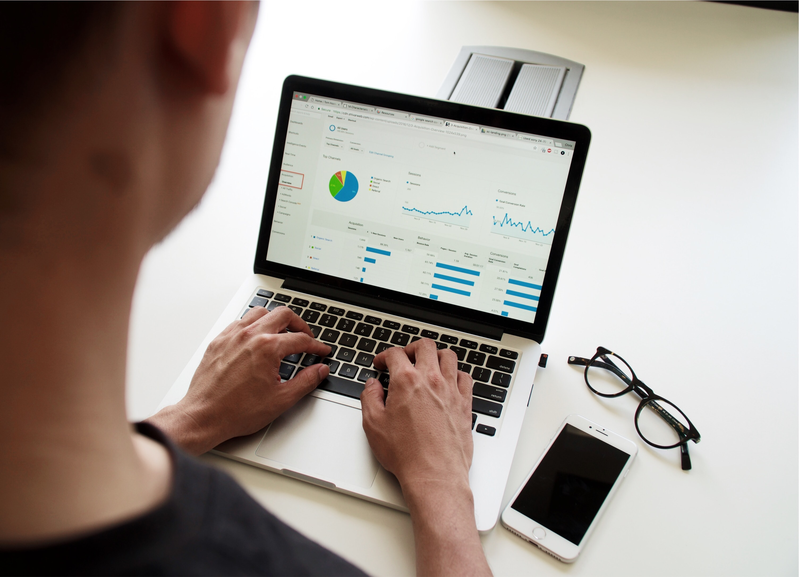
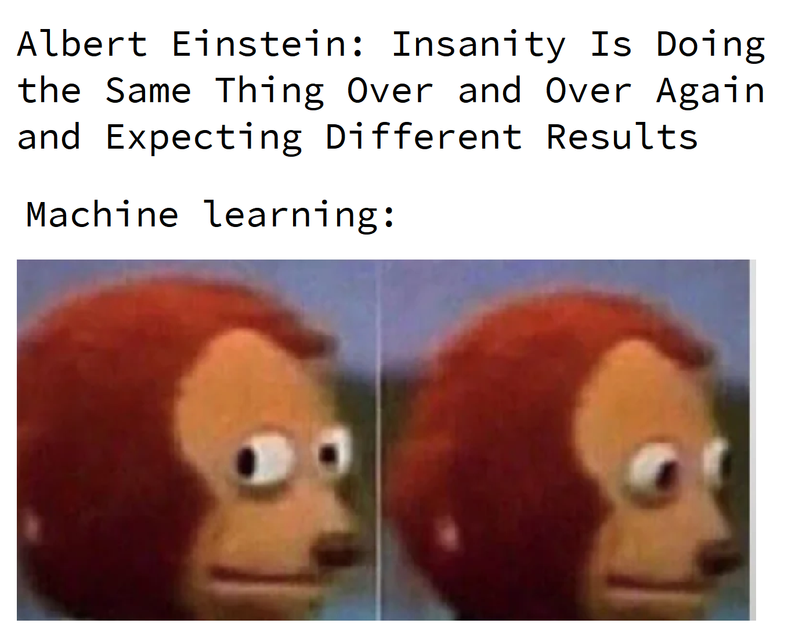

No que diz respeito a cargos, o cientista de dados é uma das maiores palavras-chave dos últimos anos. É também um dos mais crescentes campos de atuação profissional. O economista pode realmente ser um ciência de dados? Quais as habilidades necessárias?

Exposto como o ["trabalho mais sexy do século 21"](https://hbr.org/2012/10/data-scientist-the-sexiest-job-of-the-21st-century) pela ***Harvard Business Review***, aqui discutirei sobre as razões de um economista se proclamar como Cientista de Dados, e que vai muito além do *hype*.

Cientista de Dados, esse é o novo campo de atuação que todo mundo está falando hoje em dia, e que quase todo mundo quer fazer parte dele agora. É com certeza um campo de atuação profissional muito interessante, pois nasceu da junção de técnicas multidisciplinares e complementares, que não precisou de muito formalismo cientifico e consolidação acadêmica para ser chamada de Ciência ou Profissão. Porque?

O termo e o campo de atuação já existem a bastante tempo, mas pensando pelo *hype* que talvez seja por um simples motivo: os primeiros a se darem ao luxo de se intitular de Cientista de Dados, já eram profissionais exímios nas técnicas que corroboraram para a criação da mesma, ou seja, já eram profissionais qualificados em determinadas áreas que hoje foram moldadas como técnicas necessárias para ser um Cientista de Dados.

Não é particularmente fácil definir a Ciência de Dados como um todo ou em principais técnicas "necessárias", mas aqui quero falar sobre o motivo pelo qual um economista pode se proclamar como um "Data Scientist".

Como deve ser do conhecimento de alguns, no LinkedIn ou em algum outro lugar (rede social), alguns profissionais se intitulam de Cientista de Dados. Mas por que? Como estas pessoas se tornaram cientistas de dados? Por que depois de estudar Física, Engenharia da Computação, Matemática, Estatística, Economia ou qualquer outra formação profissional, agora de repente, fazem parte desse campo? Essa e entre outras perguntas que muitos fazem.

## Por que um economista pode ser um cientista de dados?

A grande sacada aqui é que não é necessário estudar isso em uma "escola formal", como cursos profissionalizantes, tecnólogos ou uma graduação universitária (claro que hoje em dia já existam todas essas coisas, até mesmo programas de pós-graduação voltados para essa área, mas como estamos vivendo na era da informação, onde uma cascata de informações está disponível na internet e de livre acesso, faz a necessidade de se ter um certificado ou diploma ser quase nula), então por que eu enquanto economista deveria ter o direito de me chamar de Cientista de Dados?

Se pensar sobre isso, estamos acostumados a seguir o caminho em que se formar em um campo específico como Economia, então você tem o direito de se chamar de Economista, mas o que acontece quando um novo campo está se desenvolvendo, e você é uma parte desse crescimento, e também não houve licenciatura específica ou pós-graduação para se tornar uma parte deste campo?

O Economista têm um conjunto de habilidades que pode o tornar bem-sucedido nesta área. Os Economistas têm treinamento extensivo na articulação de ideias complexas, algo que os alunos de outras disciplinas muitas vezes podem não ter, como *business sense* em que o valor gerado é o *business insight*.

Podemos formular aos estudantes de Economia uma pergunta ou problema difuso e eles a respondem com analises a *priori* e a *posteriori* com base em informações (dados), e então a convertem de volta em palavras compreensíveis que um não-economista poderia entender. Esta é uma habilidade muito importante para se tornar um Cientista de Dados, e que está em falta nos profissionais.

A maioria dos Cientistas de Dados não abordam problemas como os Economistas fazem, quando elaboram seus estudos e análises usando econometria. Na Ciência de Dados não existe uma teoria unificadora, o objetivo é prever os resultados dos dados, a abordagem têm seus méritos, e as previsões prevalecem na indústria.

No entanto, a sua formação como economista irá ajudá-lo a evitar tirar algumas conclusões inadequadas dos dados, como muitos cientistas de dados não tem o *felling* de como as profundas mudanças estruturais podem minar as previsões.

Mas quero sugerir aqui que a economia é --- surpreendentemente --- uma grande base para a Ciência de Dados.

Sim! Sim! Sim! Por favor, me dê uma chance de explicar melhor. Eu sei que estou sendo tendencioso, mas acredito que não existem muitos cursos que lhe proporcionem melhor treinamento para trabalhar em Ciência de Dados do que em economia.

## OK! Mas, e ai? Economista é ou não um Cientista de Dados? Como funciona?

Observando a fundo as descrições de cargos comuns em Ciência de Dados, e a grade de disciplinas das universidade que ofertam cursos de graduação em economia, pode-se deduzir rapidamente que a economia não seria o melhor treinamento a ter.

Pois a maioria dos programas de economia não ensinam linguagem de programação e bancos de dados, nem mesmo sobre projetos. O que "raios" é esse tal de **R**? **Python**? E o tal de *Hadoop*? E ainda tem *Hive* e *Pig*? E agora tem o **TensorFlow**. Isso só pode ser uma piada!

Habilidades específicas como programação e banco de dados não estão inseridas na grade curricular ou as mais importantes, no entanto, estudar Economia pode fornecer um *framework* que permitirá que você aprenda as habilidades específicas rapidamente. E uma boa educação econômica é, de fato, um sólido *background* para se ter.

Há profissionais que defendem essa tese, como é o caso do [Vítor Wilher](https://twitter.com/vitorwilherbr), que além de mestre em economia e responsável pelo site [Análise Macro](https://analisemacro.com.br/), é também professor de diversos cursos de programação na linguagem R e de análise de dados.

Essa discussão sobre a importância de saber programar alguma linguagem como ferramenta que oferece uma ótima relação entre capacidade analítica, de coleta de dados e apresentação, como as potencialidades que isto pode oferecer para estudantes e profissionais, em especial para os jovens em inicio de carreira na Economia.

Algumas razões de que Economistas são ótimos Cientistas de Dados, e que ninguém lhes diz:

### Economista já conhece o aprendizado de máquina!

Antes que passe pela sua cabeça em parar a leitura, pensando que este artigo já esta "viajando" ou que o escritor deve ter ido a uma faculdade de economia muito estranha para aprender sobre aprendizado de máquina, mas atenção:

Aprendizado de máquina ou *machine learning* é realmente apenas uma palavra muito "chique" para modelagem estatística e preditiva que os programadores inventaram para deixar o negócio mais bonito, chamar mais atenção e até mesmo manter longe os não participantes de seu clube. Talvez devem saber alguma coisa de economia, afinal de contas --- a escassez eleva os preços! (risos).



Um fato bem observando, é que os dois primeiros módulos de um curso de aprendizado de máquina (estou comentando sobre o mais popular no site do Coursera) são, regressão linear e regressão logística. (risos sarcásticos)

Pois bem, 99.99% dos economistas que participaram de uma disciplina de econometria introdutória, isso pode surpreendê-lo, mas provavelmente esses economistas tem um conhecimento mais profundo de regressão linear do que um cientista de dados junior ou pleno.

Assim como pode ser assustador se deparar com nomes como "redes neurais" ou *"support vector machines --- SVM"*, possivelmente o economista teria que trabalhar muito duro, suar a camisa mesmo para encontrar o termo "heteroscedasticidade" em qualquer lugar nos programas de aprendizado de máquina.

Para saber mais, acesse esses guias:

-   [Hacker's guide to Neural Networks](http://karpathy.github.io/neuralnets/)

-   [A Neural Network in 11 lines of Python](http://iamtrask.github.io/2015/07/12/basic-python-network/)

Mas é claro, que as redes neurais podem ser um campo bem profundo, muito mais profundo do que a forma da qual foi descrito. Assim como *Recurrent nets*, *convolutional nets*, *deep learning* são tópicos muito mais avançados e complexos --- e seus algoritmos são muito mais poderosos.

Mas para a maioria das aplicações de aprendizado de máquina, um economista deve fazer muito bem com modelos simples: redes neurais básicas, árvores de decisão binária, regressões, SVMs. E com base estatística da maioria dos cursos de economia e as aplicações econométricas, não terá problemas em entender esses conceitos rapidamente.

### Economistas tem padrões mais elevados

Sera que você consegue recitar todas as suposições básicas do método MQO? E todas as possíveis ameaças à validade interna e externa de seu modelo que possa comprometer sua análise?

Claro que pode, sei que vocês são nerds. (rsrsrs)

Pelo menos na minha experiência como acadêmico, a disciplina de econometria estava obcecada temporariamente em encontrar relações causais --- e deixando bem claro como esse fenômeno é difícil de ser observado sem ensaios controlados e randomizados.

Sem falar que a maioria dos modelos são sensíveis às suas próprias premissas básicas. Em uma palestra séria não terminaria sem que alguém mencionasse outra possível fonte de parcialidade, viés de atenuação, viés de sobrevivência, viés de seleção, erro de medição, causalidade reversa, truncamento, censura, omissão, correlação expúria, etc.

Para cada problema, existisse outro modelo --- mais complicado ainda --- para lidar com isso. Um modelo que também poderia introduzir sua própria bagagem de suposições e problemas. O mundo da econometria se tornava confuso e mais nebuloso conforme era o avanço nas disciplinas, além de causar a impressão de ser incerto e frustrantemente limitador. Então surgiu a Inteligência Artificial, *Machine Learning* e Ciência de Dados para iluminar esse caminho sombrio.

***Aviso:** exagero a grosso modo à frente.*



Comparado a tudo isso, o aprendizado de máquina é maravilhosamente, e encantadoramente mais simples. Em vez de resolver modelos explicitamente --- baseando-se em suposições rígidas --- são estimados iterativamente com o método do gradiente (e seus derivados). Ao invés de testar ou validar a teoria que está por trás do evento que você está tentando estudar, e cuidadosamente selecionando variáveis explicativas e o modelo apropriado, pode-se tentar de tudo o que puder imaginar e ver se a resposta se mantém.

Acostumar-se a validação cruzada e teste, em vez de *t-statistics*, por que não tentar algum *bootstrapping?* E falando sobre *bootstrapping*, já esta rolando na internet alguns estudos criticando o uso desta técnica, mas enquanto a discussão não se consolidar, vamos continuar a usa-lo.

Para os economistas entusiastas em econometria, isso pode parecer pura blasfêmia. Mas isso é só porque a expectativa é alta de encontrar o mesmo ML que se esperava em econometria. Inferência e interpretação causal. Porém, na maioria das vezes, o ML tem o objetivo de predizer e encontrar padrões, e não causalidade. Para alguns modelos, você não pode simplesmente dizer quais variáveis são as mais importantes para prever os resultados.

E sim! Infelizmente (trago algumas verdades) as redes neurais não podem ser usadas para explicar o efeito causal do salário mínimo sobre o desemprego. Mas o Sr. Economista (que roda modelos) também não pode esperar que um modelo como o logit (multinomial) seja usado para reconhecer uma escrita manual. O que quero dizer aqui é tudo sobre o uso correto das ferramentas certas em suas aplicações --- e tenho certeza que a econometria ensina muito bem sobre isso.

### Economistas realmente sabem como escrever relatórios coerentes!

Na ciência de dados não se resume em apenas algoritmos sofisticados, no entanto, a menos que seja um pesquisador acadêmico que apenas escreve artigos teóricos (um caso isolado, e se, somente se, for verdade, provavelmente não estaria lendo isso de qualquer maneira), a apresentação dos resultados e a escrita de forma simples, concisa e coerente estão presentes na economia.

Se um economista trabalha como cientista de dados em qualquer lugar do "mundo real", e terá que apresentar seus resultados para um públicos não técnicos --- gestores, profissionais de marketing e redatores, e clientes --- ele terá que ser capaz de mostrar por que seus resultados são importantes e como as pessoas normais podem usá-lo e agir sobre os mesmos.

Como economista, aposto que a maioria dos economistas escreveram seus quinhões de artigos, ensaios, relatórios, apresentações e dissertações e teses em seus templos --- aquela salinha de trabalho ou de estudos, sombria e só habitada por seres da sua mesma espécie --- na universidade usando ***MS Excel***, talvez um ***GRTL***, os mais corajosos ***E-Views***, ou até aqueles *outliers* que se aventuram em terras distantes usando ***Stata***.

**Não subestime essa habilidade.** Poderia gerar alguns comentários sobre o quão arcaico isto é, mas o fato é que, provavelmente ter essa habilidade coloca o economista bem à frente da maioria dos cientistas da computação e matemáticos, estatísticos ou qualquer outro profissional quando se trata de gerar analises robustas, apresentar e explicar seu trabalho com clareza --- e reunindo textos mais longos que têm estruturas e lógica por trás deles (pelo menos é isso que deveria acontecer, agora se isso ocorre de fato não sei, deixarei essa curiosidade ai no ar).

### Aprender programação não é difícil

Infelizmente, para ser um cientista de dados provavelmente terá que escrever scrips de código. Mas não excluindo o fato de que os economistas não precisassem programar também. É verdade que usar o Stata pode ser encarado como "programar", porém, não é uma linguagem de programação "adequada", mas é uma ótima introdução para quem esta iniciando na computação estatística. E se houver a possibilidade de continuar a pós-graduação, muitos programas de economia usam outras linguagens --- o Python é muito comum, assim como o R e o Matlab.

Para a alegria de alguns, o Python tornou-se a "lingua franca" da ciência de dados, talvez por ela ser uma linguagem generalista, além de ser uma linguagem muito legível e fácil de aprender. Mas [eu](https://twitter.com/hcostax) particularmente gosto do R (ops! Preferência revelada, detectada com sucesso), pois não só tem uma grande seleção de bibliotecas, mas como também tem uma comunidade amplamente ativa, além de ser construída justamente para isso.

A preferencia pela linguagem R é por ser poderosa também, mas a sintaxe é encarada como uma "ABOMINAÇÃO" por programadores de outras linguagens. O Matlab é um software comercial e, embora seja ótimo (e rápido) na computação matemática, e também tenha uma alternativa de código aberto (Octave), não é tão comum. Julia é uma linguagem muito obscura e ainda um pouco jovem demais para se dizer como uma linguagem que se adequaria bem as atividades de um cientista de dados, mas sabe-se até o momento, que os usuários aqui no Brasil estão aumentando, até mesmo alguns profissionais do Banco Central do Brasil já usam Julia.

### Então, por que ninguém lhe diz isso?

Enfim, os economistas deveriam se declarar como grandes cientistas de dados, ou pelo menos tomar posse desse termo, ou fazer o mínimo possível para adquiri-lo. Mas então por que ninguém na universidade lhes diz que esta é uma escolha de carreira no "mundo real"? Por um lado, um dos motivos é que tudo é relativamente novo. E as estruturas do curso demoram a mudar, e como demora --- favorecendo opções mais tradicionais em finanças, academia, governo.

Inclusive, na faculdade que estudei tem um [professor](http://www.roneyfraga.com/), mais conhecido como [Roney](https://twitter.com/roneyfraga) que esta se empenhando em introduzir essa mudança, e adicionar isso ao currículo de formação dos alunos de graduação, além de outros como o professor [Adriano](https://www.facebook.com/profadrianomrfigueiredo/) que também já aderiu o uso dessas linguagens de programação no ensino de economia (pra ser mais preciso, em econometria de séries temporais), mas como foi dito: o processo é lento.

Mas não pense que o economista não possa atuar como cientistas de dados nessas áreas mencionadas (finanças, academia, governo), muito pelo contrario, esta cada dia mais comum. Mas também penso que ainda há um pouco de preconceito (ou quem sabe, um pouco de medo) no mundo econômico contra a ciência de dados, pois defendem a tese de que um economista entrar na ciência de dados esta abaixo da causa-mor, pois estão preocupados com questões maiores.

Só lamento, pois é uma pena. Porque a economia dá aos seus graduados um *blend* único de habilidades (técnicas estatísticas) e *soft* (humanas) que são muito mais difíceis de encontrar nos departamentos de Matemática. Ciências da Computação, Estatística e entre outros.

E talvez os cargos de ciência de dados só se beneficiem de ter economistas (entusiastas econometristas) cuidadosos fazendo o trabalho. Assim os econometristas podem utilizar da melhor forma possível o ML quando se trata de testes e validação cruzada e abordagens algorítmicas de estimativa.

Então dê uma chance para si mesmo e conheça essa área que tem um imenso potencial de crescimento para o futuro, e até mesmo o [Economista-chefe do Google](https://qz.com/1296930/hal-varian-googles-chief-economist-thinks-the-world-needs-more-data-scientists/) acha que o mundo precisa de mais cientistas de dados.

Veja se isso chama a sua atenção, e não pense que só porque você não sabe o que são os hessianos, você não pode entrar na Ciência de Dados.

Não pretendia fazer disso um guia para os economistas sobre como se tornarem cientistas de dados. Mas possivelmente deve dar-lhe muitas coisas para pensar --- e expandir o seu leque de opções de carreira possíveis. Fiquem de olho aqui no blog, pois estarei sempre postando esse tipo de assunto. Em publicações futuras estarei postando pequenos exercícios aplicados, utilizando R ou Python para que desperte o leitor a curiosidade de aprender.

::: callout-note
# Ei! 👋, você achou meu trabalho útil? Considere me comprar um café ☕, clicando aqui 👇🏻

:::
