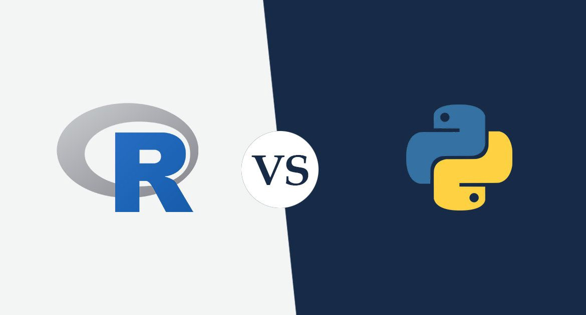

Tendo decidido melhorar minhas habilidades neste curto espaço de tempo, comecei a pesquisar as opções disponíveis sobre ciência de dados. Ficou claro rapidamente que deveria escolher uma linguagem de programação para aprender e aplicar as técnicas e a escolha recaíu em R ou Python, para mim ambas as opções são gratuitas e de código aberto e com excelente reputação, cabiam no meu orçamento e tinham uma grande comunidade de usuários ativos.

Não me lembro onde vi essa dica, mas para mim foi o fator central da minha decisão e algo que vale a pena compartilhar:

Se você for um profissional que utiliza de ferramentas de análise no âmbito empresarial, e com experiência em Microsoft Excel, a minha dica é: selecione R para iniciar sua jornada na ciência de dados. R é uma linguagem de programação funcional orientada a objeto de _thread_ único e, uma vez que você entende os comandos principais, é lógico usar. Sendo assim, é bastante previsível, o que tem sido ótimo para mim como um programador "novato". R tem um excelente pacote gráfico que complementa a ideia de analisar dados ou _data wrangling_.

Por outro lado, se você já tem alguma experiência em programação, ou é da área da computação, Python é uma linguagem de propósito muito mais geral e mais legível para quem vem desta área, e tudo que se pode fazer em Python é igual à maioria das coisas em que R é bom.

Ambos os grupos têm comunidades fortes que compartilham seus conhecimentos em vários blogs e eventos e realmente acho que ambos são ótimas escolhas. Hoje o mercado está mais aquecido quando o assunto é Python, e o profissional que conhece as duas linguagens se dá muito bem.

Agora que uso o R há cerca de 5 anos, tive a chance de usá-lo algumas vezes no local de trabalho, mostrando os recursos que esta ferramenta oferece, criando modelos econometricos e alguns relacionados a rotatividade e classificação de aprendizado de máquina para fornecer alguns _insights_ de negócios. Já realizei muitos projetos de análise para clientes particulares e me sinto honrado pelo meu esforço em aprender estar gerando resultados.

Uma certa vez, um colega especialista em Python com interesse em aprendizado de máquina viu as poucas linhas de código necessárias para organizar o conjunto de dados, treinar um modelo e prever resultados e, francamente, ele ficou chocado. Tivemos uma conversa estranha de R para Python tentando entender as diferenças entre matrizes de dados e quadros de dados (data frame) depois, embora para mim isso tenha esclarecido onde R era forte, facilidade de preparar e construir um modelo rapidamente para melhoria iterativa.

No final, a minha recomendação é: basta escolher um e começar. Embora eu ainda esteja aprendendo R, está claro para mim que também precisarei aprender muito mais sobre Python para obter os benefícios exclusivos que cada linguagem oferece, ampliados por meio da colaboração. O bom disso tudo é que, utilizando o RStudio um IDE para R, é possível utilizar a linguagem Python também.

::: callout-note
# Ei! 👋, você achou meu trabalho útil? Considere me comprar um café ☕, clicando aqui 👇🏻

:::
