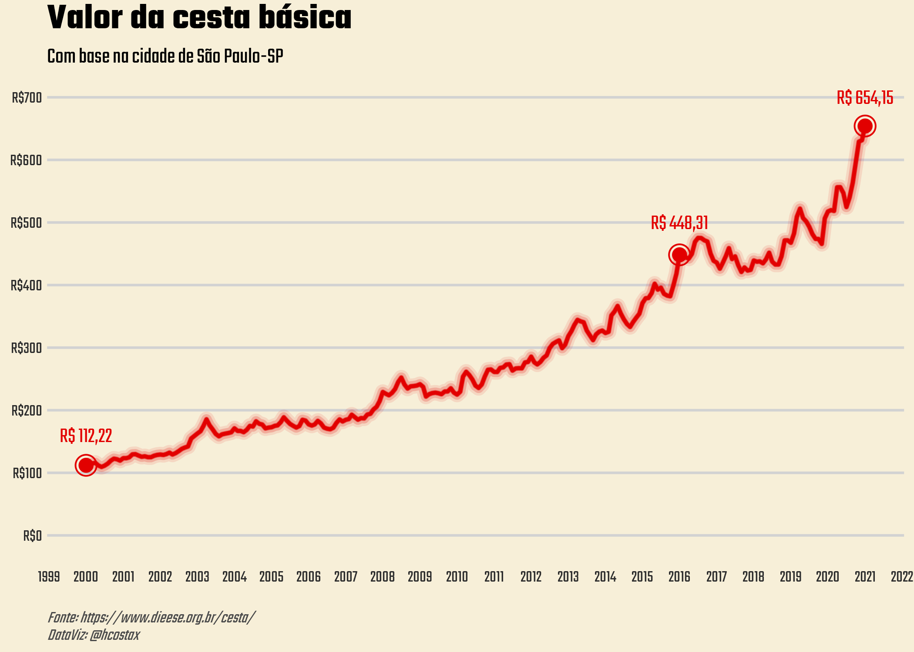
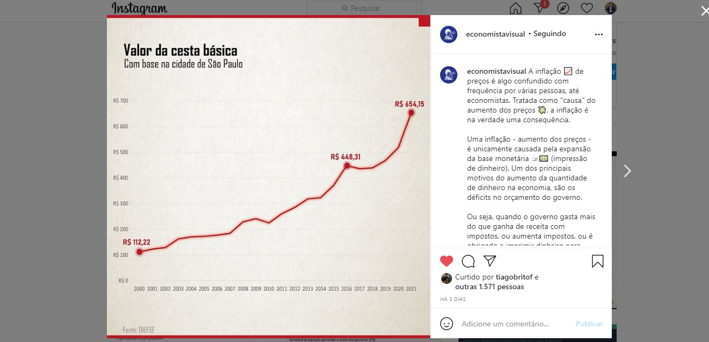
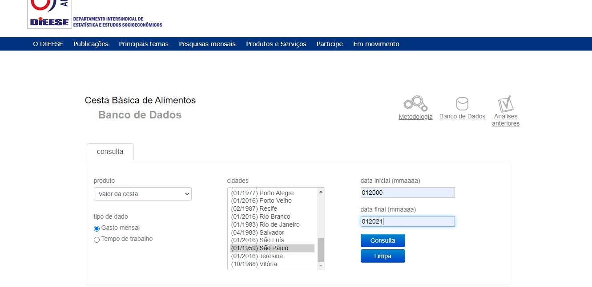

Na publicação de hoje, quero trazer uma brincadeira que fiz comigo mesmo, um pequeno incentivo para voltar a publicar conteúdos sobre R (eu já estava enferrujado) entre outros assunto sobre economia.

Passeando pelo instagram, encontrei um perfil que pública muita informação sobre economia em formato de visualização, o Economista Visual.

Vendo um gráfico sobre o [preço da cesta básica na cidade de São Paulo - SP](https://www.instagram.com/p/CLaQpRiB8pR/) 





Resolvi criar o desafio de **reproduzir** esta visualização. Claro que não conseguiria deixar igual, mas poderia chegar bem perto.

Vamos começar pela fonte dos dados. Os dados utilizado no gráfico vem da base do DIEESE (Departamento Intersindical de Estatística e Estudos Socioeconômicos), que faz o levantamento do valor da Cesta Básica de Alimentos em várias cidades do país.

Acessando o website do DIEESE, na pagina do banco de dados de [Cesta Básica de Alimentos](https://www.dieese.org.br/cesta/) é possível escolher a cidade desejada e fazer o _download_ da planilha contendo as informações sobre o valor da cesta básica.



Com os dados em mãos, é hora de ir para o RStudio e começar "os trabalhos". _Let's Code!_


```r
# para retirar notacoes cientifica
options(scipen = 999)


# Pacotes necessarios para o projeto

library(tidyverse)     # conjunto de pacotes essenciais
library(readxl)        # pacote para "ler" arquivos excel
library(lubridate)     # pacote para trabalhar com datas
library(scales)        # pacote para trabalhar com escalas
library(here)          # fluxos de trabalho orientados a projetos
```

Particularmente, prefiro utilizar um fluxo orientado a projetos e por isso o pacote `here`está na lista acima.
O pacote `here` implementa uma maneira mais simples de encontrar seus arquivos. O objetivo do pacote `here` é permitir a referência fácil de arquivos em [fluxos de trabalho orientados a projetos](https://rstats.wtf/project-oriented-workflow.html). Em contraste com o uso `setwd()`, que é frágil e dependente da maneira como você organiza seus arquivos, `here` usa o diretório de nível superior de um projeto para construir facilmente caminhos para os arquivos.

Após carregar os pacotes, é hora de ler os dados que estão na planilha em formato `.xls`. 

```r
# Para carregar os dados usaremos o codigo a seguir:

cesta_basica <- read_excel(     # funcao que ler arquivos .xls
  here::here(                   # funcao que informa o local
    "dados","exporta.xls"       # "local", "arquivo"
    )
)
```
Agora que os dados já estão no _global environment_, vamos usar de alguns "costumes" de pré-analise para conhecer os dados. Lembrando que qualquer modificação nos dados será feito inteiramente e diretamente no R.


```r
# visualizar a situacao dos dados
head(cesta_basica)              # funcao imprime no console 
                                # as 10 primeiras observacoes

## A tibble: 6 x 2
#  `Gasto Mensal - Total da Cesta` ...2     
#  <chr>                           <chr>    
# 1 NA                              São Paulo
# 2 01-2000                         112.22   
# 3 02-2000                         110.8    
# 4 03-2000                         115.13   
# 5 04-2000                         115.92   
# 6 05-2000                         111.78 
```

O resultado mostra o óbvio, que os dados precisam de "tratamento" antes de pensarmos em extrair qualquer informação. Aqui neste caso, precisa retirar a primeira linha, que contém NA (_not available_) e uma palavra (São Paulo) onde deveria ser números. Os nomes das colunas (variáveis) também necessitam de atenção. Vamos olhar um pouco mais, com a função `tail()`.

```r
tail(cesta_basica)              # funcao imprime no console 
                                # as 10 ultimas observacoes

# A tibble: 6 x 2
#  `Gasto Mensal - Total da Cesta`    ...2          
#   <chr>                              <chr>         
# 1 11-2020                            629.179999999~
# 2 12-2020                            631.460000000~
# 3 01-2021                            654.149999999~
# 4 Fonte: DIEESE                      NA            
# 5 (1) Série recalculada, conforme mudança metodológica realizada # na ~ NA            
# 6 Tomada especial de preços a partir de abril de 2020 NA    
```

Como esperado, só reforça a necessidade de um tratamento simples nos dados. _A priori_ é uma "limpeza" de linhas indesejadas. 

Por boas práticas, irei modificar o "nome" do objeto (data frame), pois CB é mais simples e fácil que cesta_basica. 


```r
CB <- cesta_basica %>%          # criando um objeto reduzindo
                                # o nome do dataframe para CB
                                # ao inves de cesta_basica
                                # e usando o operador " %>% "
  
  rename(                       # funcao para renomear colunas
    Data = `Gasto Mensal - Total da Cesta`,
    Valor = ...2
  ) %>%                       
  slice(2:255)                  # funcao que corta os dados
                                # retirando apenas o desejado
```

Agora temos que verificar as características dos nossos dados. Utilizo a função `srt()`.

```r
str(CB)

# tibble [254 x 2] (S3: tbl_df/tbl/data.frame)
# $ Data : chr [1:254] "01-2000" "02-2000" "03-2000" "04-2000" ...
# $ Valor: chr [1:254] "112.22" "110.8" "115.13" "115.92" ...
```

Temos 254 observacoes e 2 colunas (variaveis) as 2 variaveis estao em formato -`chr`- caracteres e precisamos modificar esses formatos, passando a variavel `Valor` para o formato númerico, e a variável Data como datas, para isso utilizaremos os passos a seguir:


```r
CB <- CB %>%                   # substituindo o dataframe
  mutate(                      # funcao p/ modificar variaveis
    Data = rep(seq(            # Substituindo a variavel Data
                               # por uma variavel no formato de datas
                               # criando uma sequencia de datas
      from = as.Date("2000-01-01"),
      to = as.Date("2021-01-01"),
      by ="1 month"
    )),
    Valor = as.numeric(Valor) # modificando a variavel ´Valor´
                              # para o formato numerico
  )

# Erro: Problem with `mutate()` input `Data`.
# x Input `Data` can't be recycled to size 254.
# i Input `Data` is `rep(...)`.
# i Input `Data` must be size 254 or 1, not 253.
```

Percebemos esse erro que significa que o vetor de datas que tentamos criar nao é do mesmo "tamanho" que a variavel Data anterior. A variavel Data tem 254 observacoes e nosso vetor de datas tem apenas 253. Totalmente sem sentido, pois criamos um vetor de datas que segue uma sequencia mes a mes de 01/01/2000 ate 01/01/2021.

_A priori_, temos a hipótese de que há valores e data repetidas como a base de dados eh pequena (254 obs) usaremos a funcao View() para ver a base completa e entende-la para encontrar a observacao repetida.

Encontramos a observacao 193, com a data 12-2015 (1) e valor de 418.13. Como nao pesquisei a fundo o motivo, vou considerar como um reajuste no valor, entao irei retirar a observacao anterior (192). 

Vou utilizar novamente o codigo acima, porém com um _upgrade_, adicionarei a funcao slice() para recortar a observacao 192.


```r
CB <- CB %>%                   # substituindo o dataframe
  slice(-192) %>%              # funcao p/ recortar 
  mutate(                      # funcao p/ modificar variaveis
    Data = rep(seq(            # Substituindo a variavel Data
                               # por uma variavel no formato de dadtas
                               # criando uma sequencia de datas
      from = as.Date("2000-01-01"), 
      to = as.Date("2021-01-01"), 
      by ="1 month"
    )),
    Valor = as.numeric(Valor)  # modificando a variavel ´Valor´
                               # para o formato numerico
  )
```

Agora vamos para a parte mais delicada de todo o desafio: criar a visualização, ou seja, reproduzir um gráfico parecido com o gráfico que foi publicado pelo Economista Visual.

Antes de construir o gráfico, vamos elaborar a customização de uma tema para aplicar juntamente com o pacote `ggplot2`. Esta customização nos ajudará a gerar um gráfico parecido. 

Na construção do tema, precisamos usar a mesma fonte que o Economista Visual usa em seu gráfico, mas preferir não investigar qual fonte é usada, e usei uma fonte qualquer. Decidir usar a fonte Teko, que pode ser encontrada no [Google Fonts](https://fonts.google.com/specimen/Teko?preview.text_type=custom)


```r
custom_theme <- function(){
  font <- "Teko"             # definindo a fonte a ser utilizada
  theme(
    # Elementos de grade e painel
    panel.border =  element_blank(),       # sem borda
    panel.grid.major.x = element_blank(),  # sem grades em X
    panel.grid.minor.x = element_blank(),  # sem grades em X
    panel.grid.major.y = element_line(
    color = "#d2d2d2"                      # cor para a linha
    ),                                     # da grade em Y
    panel.grid.minor.y = element_blank(),  # sem grades menor em Y,     
    axis.ticks = element_blank(),          # tira pontos do eixo
    # Elementos textuais
    plot.title = element_text(             # Titulo
      family = font,                       # definir font
      size = 20,                           # definir tamanho
      face = 'bold',                       # negrito
      color = "black",                     # cor da fonte
      hjust = 0,                           # ajuste p/ esquerda*
      vjust = 2),                          
    
    # *O valor de hjust e vjust sao 
    # definidos entre 0 e 1:
    # 0 significa justificado a esquerda
    # 1 significa justificado a direita
    # 0.5 significa justificado ao meio
    
    plot.subtitle = element_text(          # Sub-titulo
      family = font,                       # fonte
      color="black",                       # cor da fonte
      size = 12),                          # tamanho
      
    plot.caption = element_text(           # Legenda
      family = font,                       # fonte
      size = 9,                            # tamanho da fonte
      face = "italic",                     # italico
      colour = "#4c4c4c",                  # cor da fonte
      hjust = 0),                          # ajuste a esquerda
    
    axis.title = element_text(             # Titulo dos eixos
      family = font,                       # fonte
      face = 'bold',                       # negrito
      color = "#2e2e2e",                   # cor da fonte
      size = 10),                          # tamanho
    
    axis.text = element_text(              # Texto dos eixos
      family = font,                       # fonte
      color = "#2e2e2e",                   # cor
      size = 9),                           # tamanho
    
    axis.text.x = element_text(            # margem p/ texto dos eixos
      color = "#2e2e2e",                   # cor
      margin=margin(5, b = 10)),
    
    axis.text.y = element_text(            # margem p/ texto dos eixos
      color = "#2e2e2e",                   # cor
      margin=margin(10, b = 20)),
    
    legend.position="bottom",              # Posição da legenda
                                           # bottom = meio-inferior
    legend.title = element_blank(),        # Anular o título da legenda
    legend.text = element_text(
      colour="#2e2e2e",                    # cor da legenda 
      family = font                        # fonte
    ),
    plot.background = element_rect(
      fill = "#f7efd8",                    # cor de fundo do grafico
      colour = NA
      ),
    panel.background = element_rect(
      fill = "#f7efd8",                    # cor de fundo do painel
      colour = NA
      )
    
    # since the legend often requires manual tweaking 
    # based on plot content, don't define it here
  )
}
```

Com esse bloco de código acima, definimos o tema personalizado para aplicarmos ao gráfico. O gráfico do Economista Visual, usa uma fonte diferente do comum, fonte que não sei qual é, e o seu título e sub-título na cor preta com ajuste a esquerda (definimos isso no tema que customizamos acima), texto nos eixos em uma cor parecido com um cinza numa escala mais clara, a mesma cor para a legenda que também é ajustada a esquerda, e por fim, o gráfico é do tipo linha, na cor vermelha com um efeito "glow", ponto sólido menor que o circulo, e anotação em texto, tudo na cor vermelha. 

O eixo X é composto pelos anos observados (datas), e a escala do eixo X inicia no ano 2000 e termina no ano 2021 com intervalos a cada 1 ano. Já no eixo Y, temos os valores na escala de 0 a 700, com intervalo a cada 100.

Tendo essas informações em mente, é hora de elaborarmos o gráfico. Para isso, será utilizado as funções do pacote `ggplot2` e aplicaremos o tema customizado para ajustar a estética do nosso gráfico ao gráfico do Economista Visual. 


```r
plot <- CB %>%              # definindo o gráfico
  ggplot(aes(x=Data)) +     # adicionando apenas o eixo X
  geom_line(                # 1° linha do eixo Y
    aes(y = Valor),         # definindo o Valor para o eixo Y
    size = 3,               # espessura da linha
    colour = '#e20000',     # cor (esolhi um verlho aleatorio)
    alpha = 0.1             # alpha mede a transparência
    ) +
  geom_line(                # 2° linha do eixo Y
    aes(y = Valor),         # definindo o Valor para o eixo Y
    size = 2,               # espessura (menor que a 1°)
    colour = '#e20000',     # cor (a mesma cor para todas)
    alpha = 0.2             # transparência (maior que a 1°)
    ) +
  geom_line(                # 3° linha do eixo Y
    aes(y = Valor),         # definindo o Valor para o eixo Y
    size = 1,               # espessura (menor que a 2°) 
    colour = '#e20000',     # cor
    alpha = 0.5             # transparência (maior que a 2°)
    ) +
  geom_line(                # 4° linha do eixo Y
    aes(y = Valor),         # definindo o Valor para o eixo Y
    size = 0.75,            # espessura (menor que a 3°)
    colour = '#e20000'      # cor
    ) +                     # sem alpha, para deixar a cor sólida
  annotate(                 # 1° anotação 1/3
    geom="text",            # tipo de anotação: texto
    x=as.Date("2000-01-01"), # ponto que a anotação deve aparecer
    y=160,                  # ajustando a altura do anotação
    label="R$ 112,22",      # Texto de referência
    size=4,                 # tamanho do texto
    color = "#e20000",      # cor do texto (a mesma da linha)
    family = "Teko"         # fonte do texto (opcional)
    ) +
  annotate(                 # 1° anotação 2/3
    geom="point",           # tipo de anotação: ponto
    x=as.Date("2000-01-01"), # ponto que a anotação deve aparecer
    y=112,                  # ponto cruzado entre X e Y
    size=3,                 # tamanho do ponto
    color = "#e20000"       # cor do ponto
    ) +
  annotate(                 # 1° anotação 3/3
    geom="point",           # tipo de anotação: ponto
    x=as.Date("2000-01-01"), # ponto que a anotação de aparecer
    y=112,                  # ponto cruzado entre X e Y
    size=5,                 # tamanho do ponto
    shape=21,               # formato do ponto
    fill="transparent",     # preenchimento transparente
    color="#e20000"         # cor, aplica somente na borda 
    ) +
  annotate(                 # 2° anotação 1/3
    geom="text",            # tipo de anotação: texto
    x=as.Date("2016-01-01"), # ponto que a anotação deve aparecer
    y=500,                  # ajustando a altura da anotação
    label="R$ 448,31",      # texto de referência
    size=4,                 # tamanho do texto
    color = "#e20000",      # cor do texto
    family = "Teko"         # fonte do texto
    ) +
  annotate(                 # 2° anotação 2/3
    geom="point",           # tipo de anotação: ponto
    x=as.Date("2016-01-01"), # ponto que a anotação deve aparecer
    y=448.31,               # ponto cruzado entre X e Y
    size=3,                 # tamanho do ponto
    color = "#e20000"       # cor do ponto
    ) +
  annotate(                 # 2° anotação 3/3
    geom="point",           # tipo da anotação: ponto
    x=as.Date("2016-01-01"), # ponto que a anotação deve aparecer
    y=448.31,               # ponto cruzado entre X e Y
    size=5,                 # tamanho do ponto
    shape=21,               # formato do ponto
    fill="transparent",     # preenchimento transparente
    color="#e20000"         # cor somente na borda
    ) +
  annotate(                 # 3° anotação 1/3
    geom="text",            # tipo de anotação: texto
    x=as.Date("2021-01-01"), # ponto que a anotação deve aparecer
    y=700,                  # ajustando a altura da anotação
    label="R$ 654,15",      # texto de referência
    size=4,                 # tamanho do texto
    color = "#e20000",      # cor do texto
    family = "Teko"         # fonte do texto
    ) +
  annotate(                 # 3° anotação 2/3
    geom="point",           # tipo de anotação: ponto
    x=as.Date("2021-01-01"), # ponto que a anotação deve aparecer
    y=654.15,               # ponto cruzado entre X e Y
    size=3,                 # tamanho do ponto
    color = "#e20000"       # cor do ponto
    ) +
  annotate(                 # 3° anotação 3/3
    geom="point",           # tipo de anotação: ponto
    x=as.Date("2021-01-01"), # ponto que a anotação deve aparecer
    y=654.15,               # ponto cruzado entre X e Y
    size=5,                 # tamanho do ponto
    shape=21,               # formato do ponto
    fill="transparent",     # preenchimento transparente
    color="#e20000"         # cor somente na borda
    ) +
  labs(                     # rótulos
    x = NULL,               # anula rótulo do eixo X
    y = NULL,               # anula rótulo do eixo Y
    # título
    title='Valor da cesta básica',
    # sub-título
    subtitle = "Com base na cidade de São Paulo-SP",
    # legenda
    caption='Fonte: https://www.dieese.org.br/cesta/ \nDataViz: @hcostax'
    ) +
  scale_x_date(             # definindo escalas p/ eixo X
  date_breaks = "1 year",   # intervalos de 1 ano
  date_labels = "%Y"        # rotular somente o ano
  ) +
  scale_y_continuous(       # definindo escalas p/ eixo Y
    breaks = seq(           # definindo o intervalo
      from = 0, 
      to = 700, 
      by = 100
      ),
    limits=c(0, 700),       # definindo os limites
    labels = scales::dollar_format( # adicionando notação monetária
      prefix="R$"           # definindo como "R$" real brasileiro
      )
  ) +
  custom_theme()            # aplicando o tema customizado

# ---

print(plot)                 # gerando o gráfico

# ---
```


Esse enorme bloco de código gera o gráfico final. O resultado foi bastante satisfatório (p/ mim, rsrs). Após executar todos esses passos temos o gráfico: 


O gráfico não ficou exatamente igual ao gráfico publicado no perfil do Economista Visual no instagram, mas chegamos bem próximo. O objetivo aqui foi reproduzir a informação, e para deixar mais divertido, reproduzir aos moldes do original. 

Você também pode reproduzir isso escolhendo a cidade que quiser.

Confira o código completo no meu [Github](https://github.com/hcostax/01---Desafio_EconomistaVisual).


::: callout-note
# Ei! 👋, você achou meu trabalho útil? Considere me comprar um café ☕, clicando aqui 👇🏻

<a href="https://www.buymeacoffee.com/hcostax"></a>
:::
